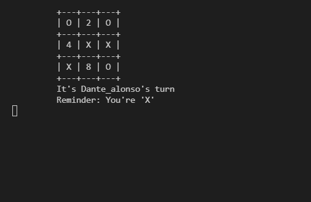

 ?style=plastic&logo=ruby>)

# OOP - Tic Tac Toe game using Ruby 🙉  

> This repository is about an example of how to build your own tic tac toe game from scratch using Ruby.

As you can see in this repository, the main idea is to create one of the most popular games in history (**Tic Tac Toe**) using Ruby as the programming language, then the repository is to improve the *OOP* (**Object Oriented Programming**) concepts by making Tic Tac Toe game.

## Game Description

***

The game Tic tac toe _(also called Noughts and crosses, Xs and Os, XOX Game)_ is a too popular game around the world, it simple and quick game to play with people of all ages and provide brain workout too for anybody. Try to place at first 3 Xs / 3 Os in a vertical, horizontal, or diagonal row to win the game.

### How to play 🎮🕹

---

Follow the next steps to start to play Tic Tac Toe.

1.- Use your terminal, search it in your PC or hit at the same time the next keyboard shortcuts: 

    - For Windows:  
        **Windows** + **R**  
        Then type _"cmd"_ and hit **Enter**  
    - For Ubuntu:  
        **Ctrl** + **Alt** + **T**  
        Then type _"gnome-terminal"_ and hit **Enter**  
    - For MAC Os  
        Open _"Launchpad"_ or type **F4**  
        Then click on _"Others group files"_  
        Finally, click on _"Terminal"_  

2.- Use _"cd" + file-path_ to stay in the game's folder.  
    For example: `cd C:\Users\Dante\Documents\tic_tac_toe_ruby`  
3.- Now type `ruby bin/main.rb` to start up the Tic Tac Toe's game.  
4.- Have fun (It's mandatory to accomplish this step).

### Rules 📜

---

1. Type _player_1 name_, it will use the **'X'** symbol in the game.
2. Type _player_2 name_, it will use the **'O'** symbol in the game.
3. The game will show you who starts, **must use a number between (1..9)** available in the game, don't repeat them until finish the current match.
4. The first one who places at first 3 Xs / 3 Os in a vertical, horizontal, or diagonal row will win the game.

## Built With 🔨

- Ruby
- Visual Studio Code
- Git & Github

### Install

To get a local copy up and running follow these simple example steps.
- Open terminal
- Clone this project by command `git clone https://github.com/DanteAlonsoHT/tic_tac_toe_ruby.git`
- `Cd tic_tac_toe_ruby` folder
- Run `bin/main.rb` with Ruby in your terminal

## Getting Started 

- Tic tac toe to improve and applying OOP in gaming using Ruby.
- I've included linters to improve and cleaning the Ruby code.

### Prerequisites

- IDE to edit and run the code (I used Visual Studio Code 🔥).

### Usage

- For anyone who wants to practice Ruby.
- How to apply yield in Ruby.

## Author

👤 **Dante Alonso Hernández Tapia**

- GitHub: [@DanteAlonsoHT](https://github.com/DanteAlonsoHT)
- Twitter: [@dante_dante1](https://twitter.com/dante_dante1)
- LinkedIn: [Dante Alonso](https://www.linkedin.com/in/dante-hernandez99/)

## 🤝 Contributing

Contributions, issues, and feature requests are welcome!

Feel free to check the [issues page](https://github.com/DanteAlonsoHT/tic_tac_toe_ruby/issues).

## Show your support

Give a ⭐️ if you like this project!

## Acknowledgments

- Hat tip to anyone who's code was used 🔰
- Inspiration 💘
- Microverse program ⚡
- My standup team 🏹
- My family's support 🙌

## 📝 License

This project is [MIT](./LICENSE) licensed.